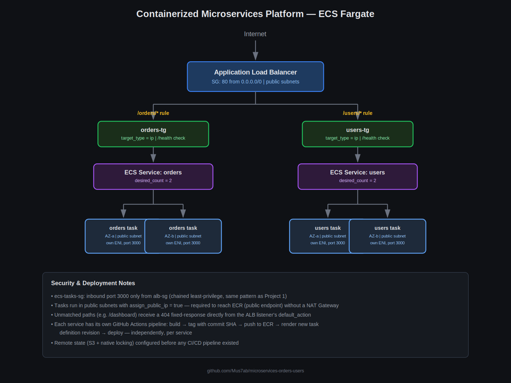

# Containerized Microservices Platform (ECS Fargate)

Two independently deployable microservices — `orders` and `users` — containerized with Docker, orchestrated on AWS ECS Fargate, and routed through a single Application Load Balancer using path-based routing. Provisioned entirely with Terraform and deployed through per-service GitHub Actions pipelines.

## Problem Statement

An e-commerce-style backend needs to scale its `orders` and `users` functionality independently, with each service owned, deployed, and scaled on its own schedule — without one service's release cycle blocking or affecting the other. This project simulates that split: a monolith broken into two services sharing common networking and load balancing infrastructure, but with fully independent build and deploy pipelines.

## Architecture



```
                         Internet
                            │
                            ▼
                  ┌──────────────────┐
                  │   ALB (public)   │◄── SG: 80 from 0.0.0.0/0
                  └────────┬─────────┘
                            │
              ┌─────────────┴─────────────┐
              ▼                           ▼
      /orders/* rule                /users/* rule
              │                           │
              ▼                           ▼
    ┌──────────────────┐        ┌──────────────────┐
    │  orders-tg (IP)   │        │  users-tg (IP)   │
    └─────────┬─────────┘        └─────────┬─────────┘
              │                           │
              ▼                           ▼
   ┌───────────────────┐       ┌───────────────────┐
   │ ECS Service:orders │       │ ECS Service:users  │
   │ desired_count = 2  │       │ desired_count = 2  │
   └─────────┬──────────┘       └─────────┬──────────┘
              │                           │
              ▼                           ▼
   Fargate Tasks (AZ-a, AZ-b)  Fargate Tasks (AZ-a, AZ-b)
   public subnets, own ENI     public subnets, own ENI
   SG: 3000 from ALB-SG only   SG: 3000 from ALB-SG only
```

Unmatched paths (anything other than `/orders*` or `/users*`) receive a `404` directly from the ALB listener's default action.

## AWS Services & Tools Used

| Service/Tool | Purpose |
|---|---|
| Docker | Containerizes each service independently |
| Amazon ECR | Private registry storing versioned, SHA-tagged images |
| ECS Fargate | Serverless container orchestration — no EC2 servers managed |
| Application Load Balancer | Single public entry point with path-based routing |
| IAM (Execution Role) | Scoped permissions for ECS to pull images and write logs |
| CloudWatch Logs | Centralized container logs, 7-day retention |
| VPC (2 AZs, public subnets) | Network foundation, non-overlapping CIDR from Project 1 |
| Security Groups (chained) | ALB → ECS tasks, least-privilege by security-group-source |
| S3 (remote state) | Shared Terraform state between local and CI, configured proactively |
| GitHub Actions (per-service) | Independent build/deploy pipelines for each microservice |

## How to Deploy

**Prerequisites:** Terraform ≥ 1.9, Docker, AWS CLI configured.

```bash
git clone https://github.com/Mus7ab/microservices-orders-users.git
cd microservices-orders-users/terraform
terraform init
terraform plan
terraform apply
```

Build and push images manually (first deploy only — after this, CI/CD handles it automatically):
```bash
aws ecr get-login-password --region ap-south-2 | docker login --username AWS --password-stdin 342677169816.dkr.ecr.ap-south-2.amazonaws.com
docker build -t 342677169816.dkr.ecr.ap-south-2.amazonaws.com/orders-service:v1 services/orders
docker push 342677169816.dkr.ecr.ap-south-2.amazonaws.com/orders-service:v1
# repeat for users-service
```

CI/CD: pushing changes to `services/orders/**` or `services/users/**` automatically builds, tags with the commit SHA, pushes to ECR, and deploys a new ECS task definition revision for that service only.

## Design Decisions

**1. Fargate tasks in public subnets, not private + NAT Gateway.** ECR is reached over the public internet, so private-subnet tasks would require a NAT Gateway (~$32/month, never free-tier eligible) purely to pull images. Security is enforced entirely through the `ecs-tasks` security group — only traffic from the ALB's security group is allowed — rather than subnet isolation. The same cost/architecture tradeoff made for EC2 in Project 1, applied here for a different underlying technical reason.

**2. `target_type = "ip"` instead of the default `"instance"`.** A direct architectural consequence of `awsvpc` network mode: each Fargate task gets its own ENI and private IP, with no EC2 instance ID to register against a target group.

**3. Per-service CI/CD pipelines instead of one combined workflow.** `orders` and `users` each have their own GitHub Actions workflow, triggered only by changes to their own service path. This is the direct technical expression of microservices' core value — independent deployability — verified explicitly during development by confirming one service's pipeline never triggers on the other's changes.

**4. Explicit task definition revisioning, not `--force-new-deployment` alone.** Initially, deployments used `aws ecs update-service --force-new-deployment`, which restarts tasks but silently reuses whatever image the *existing* task definition already references — it does not know a new image was pushed. Diagnosed by checking `aws ecs describe-services` directly and noticing both the new and old deployments pointed at the same task definition revision, despite a passing pipeline. Fixed by explicitly rendering and deploying a new task definition revision (`amazon-ecs-render-task-definition` + `amazon-ecs-deploy-task-definition`) that references the newly built image.

**5. Container images tagged with the Git commit SHA, not a static tag like `v1`.** Enables Decision 4's fix to work correctly — every deployment references an immutable, uniquely identifiable image, fully traceable to the exact commit that produced it, and trivially reversible by redeploying a prior SHA-tagged image.

## Known Limitations / What I'd Improve at Scale

- No HTTPS listener yet — pending an ACM certificate, same as Project 1
- ECR repositories currently have `scanOnPush: false` — image vulnerability scanning is planned for Project 6 (DevSecOps), alongside a lifecycle policy to clean up untagged/old images automatically
- The CI/CD IAM user uses `PowerUserAccess` plus a scoped inline policy; a fully custom least-privilege policy remains a further hardening step
- Only one environment (no dev/staging/prod separation) — addressed directly in Project 4
- No autoscaling configured on the ECS services yet (fixed `desired_count = 2`) — a natural next step once real traffic patterns exist

## Cost Estimate

Actual cost incurred while building this project (verified via AWS Billing Console, ~16 days spanning development, including a continuously-running ALB and 4 Fargate tasks across 2 services): **$7.83 month-to-date**, covered by AWS's Free Plan credits. Notably higher than Project 1's $1.94 — Fargate compute has no free-tier allowance at all, unlike EC2, so every vCPU-second and GB-second is billed from the start. Approximate on-demand costs if run beyond free coverage: ALB ~$16-20/month + LCU usage, 4 Fargate tasks (256 CPU/512MB each) ~$25-30/month combined, ECR storage negligible (<$1/month).

## Teardown

```bash
cd terraform
terraform destroy
```
Confirms and removes every resource. ECR repositories and their images are managed separately (not destroyed by Terraform in this setup) — see teardown notes below for manual cleanup steps if needed.
